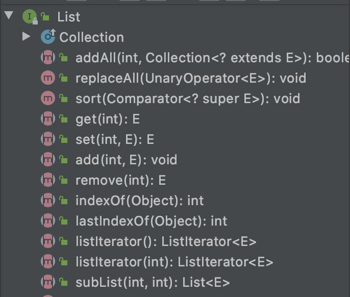
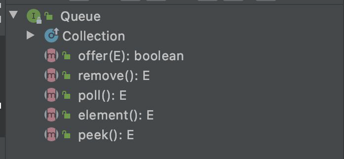
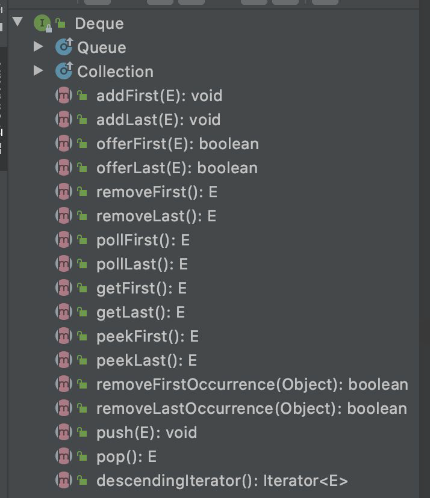
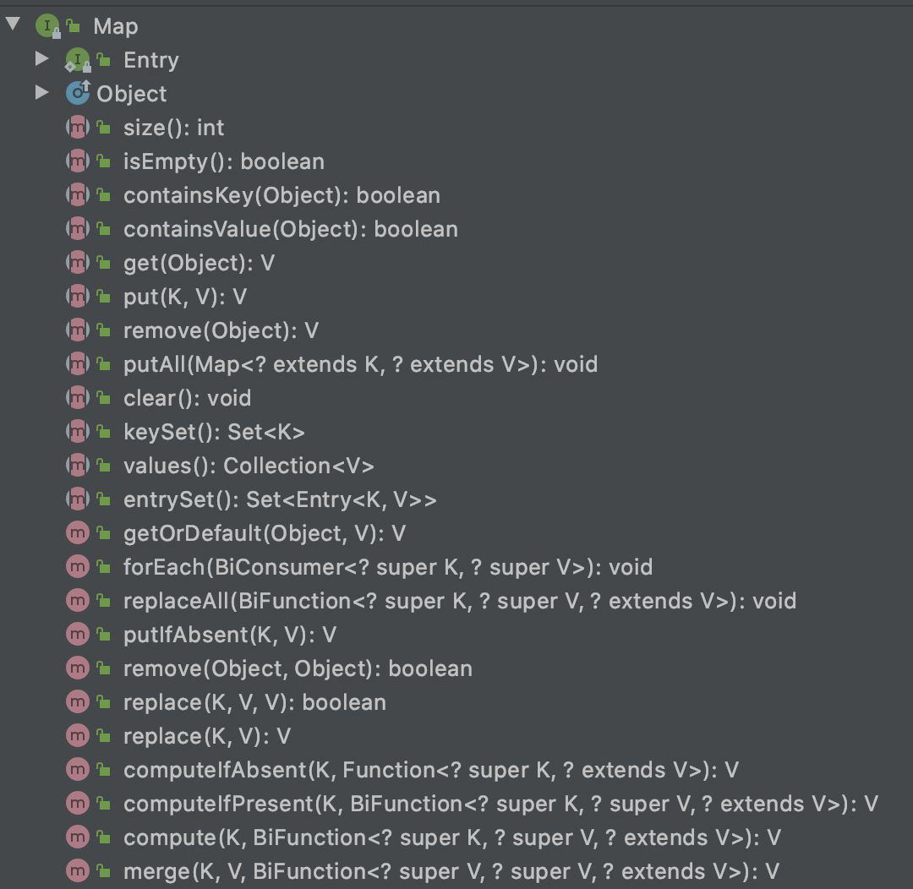

# Java Collection

Pertemuan #2 Kelas Praktisi

---

## Pembahasan

- Pengenalan Collection
- Iterable
- List
- Set
- Queue
- Deque
- Map

---

## Pengenalan Java Collection

**Collection** atau yang biasa disebut dengan **container** adalah object yang mengumpulkan atau berisikan data-data, seperti Array. Perbedaan array dengan collection adalah array bersifat _statis_ sedangkan collection bersifat _dinamis_.

Pada dasarnya, teknik pengelompokannya terbagi menjadi 3 :
**1. Set**
**2. List**
**3. Queue**

| Set           | List       | Queue         |
| ------------- | ---------- | ------------- |
| Hash Set      | Array List | LinkedList    |
| LinkedHashSet | Vector     | PriorityQueue |
| Tree Set      | LinkedList |

---

### Iterable dan Iterator Interface

Perbedaan Iterable dan Iterator Interface adalah sebagai berikut :
|Iterable|Iterator Interface|
|---|---|
|Parent semua collection (_kecuali map_)|Interface yang menetapkan metode untuk mengakses elemen dalam koleksi secara berurutan

- Kode Iterable

```java
Iterable<String> names = List.of("nada","almira");
for(var name: names) {
    System.out.println(name);
    }
```

- Kode Iterator Interface

```java
Iterator<String> iterator = names.iterator();
while (iterator.hasNext()) {
        String name = iterator.next();
        System.out.println(name);
}
```

---

### List Interface

List adalah struktur data collection yang bisa diduplikat atau bisa memasukkan data yang sama berurutan sesuai dengan posisi kita memasukkan data dan memiliki nomer index.

List Interface dibagi menjadi 3, yaitu :

1. ArrayList
2. Vector
3. LinkedList

- ArrayList -> Implementasi dari List menggunakan array.
- LinkedList -> Implementasi List dengan struktur data Double Linked List.
- Vector -> Bentuk array dinamis,sehingga tidak perlu mengubah ukuran array saat melakukan penambahan pada array yang sudah penuh.

### ArrayList vs LinkedList
|Operasi|ArrayList|LinkedList|
|---|---|---|
|add|Cepat|Cepat|
|get|Cepat|Lambat|
|set|Cepat|Lambat|
|remove|Lambat|Cepat|

- Method List

- Kode ArrayList
```java
Collection<String> names = new ArrayList<>();
        names.add("nada");
        names.add("almira");
        names.addAll(Arrays.asList("nada", "nidi", "nudu"));

        names.remove("nudu");

        System.out.println(names.contains("nudu")); //untuk cek data -- true or false

        for(var name: names){
            System.out.println(name);
        }
```
- Kode LinkedList
```java
List<String> names = new LinkedList<>();
        names.add("nada");
        names.add("almira");

        for(var name: names){
            System.out.println(name);
        }
```
- Kode Vector
```java
Vector<Integer> vec = new Vector<Integer>();
        vec.add(22);
        vec.add(10);
        vec.add(15);
        System.out.println("Jumlah elemen vector : " +vec.size());
```
---
### Queue
Queue adalah implementasi dari struktur data Antrian atau FIFO (First In First Out).

Queue dibagi menjadi 2 yaitu **LinkedList** dan **Priority Queue**

Perbedaan ArrayDequeue, LinkedList, dan Priority Queue :
|ArrayDequeue|LinkedList|Priority Queue|
|---|---|---|
|menggunakan array sebagai implementasi queue nya|menggunakan double linked list sebagai implementasi queue nya|menggunakan array sebagai implementasi queue nya, namun diurutkan mennggunakan Comparable atau Comparator

- Method Queue
  
- Kode Queue
```java
Queue<String> names = new ArrayDeque<>();
        names.offer("nada");

        for(String next = names.poll(); next != null; next = names.poll()) {
        }
        System.out.println(names.size());
```
---
### Dequeue
Deque (double ended queue) artinya queue yang bisa beroperasi dari depan atau belakang.
Dequeue dibagi menjadi 2 yaitu **LinkedList** dan **ArrayList**

- Jika pada queue, operasi yang didukung ada **FIFO**. Pada dequeue tidak hanya **FIFO**, namun juga mendukung **LIFO** *(Last In First Out)*
- Bisa dibilang deque adalah implementasi struktur data antrian dan **stack** *(tumpukan)*

- Method Dequeue
  
- Kode Dequeue
```java
Deque<String> names = new ArrayDeque<>();
        names.offerLast("nada");
        names.offerLast("almira");
        names.offerLast("maulida");

        for(String next = names.pollLast(); next != null; next = names.pollLast()){
            System.out.println(next);
        }
```
---
### Map Interface
Map adalah struktur data collection yang berisikan mapping antara key dan value. Key di Map harus unik dan tidak boleh duplikat. Map mirip dengan array, namun bedanya Map dapat ditentukan sendiri *(tidak harus index seperti integer).*

Map dibagi menjadi 5, yaitu :
1. HashMap
2. Weak HashMap
3. Identity HashMap
4. Linked HashMap
5. Enum HashMap

- Method Map

- Kode HashMap
```java
Map<String, String> map = new HashMap<>();
map.put("Nada", "Almira");
System.out.println(map.get("Nada));
```